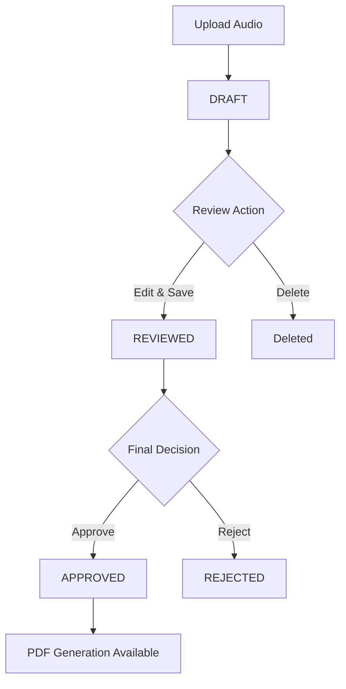

# CaseSync - FIR Management System

## Overview

CaseSync is a comprehensive digital solution for First Information Report (FIR) management, designed specifically for law enforcement agencies. The system automates the process of creating, reviewing, and managing FIRs using advanced speech-to-text technology, natural language processing, and provides complete workflow management including draft deletion and case rejection capabilities.

## Key Features

- **Audio-to-Text Conversion**: Upload audio recordings and automatically generate text transcriptions using Deepgram API
- **Intelligent Form Population**: AI-powered extraction of key information from audio recordings
- **Multi-language Support**: Handle recordings in multiple languages (English, Hindi)
- **Complete Officer Review System**: Dedicated review workflow with approve, reject, and edit capabilities
- **Draft Management**: Delete draft FIRs before submission
- **Status Workflow**: DRAFT → REVIEWED → APPROVED/REJECTED status transitions
- **Enhanced Dashboard**: Statistics grid showing all case statuses including rejected cases
- **PDF Report Generation**: Create professional PDF reports for approved FIRs
- **Secure File Management**: Organized storage and retrieval of audio files and documents
- **Batch Automation**: Windows batch files for complete project lifecycle management

## Technology Stack

### Backend

- **FastAPI**: Modern, fast web framework for building APIs with Python 3.7+
- **SQLite**: Lightweight, serverless database for efficient data storage
- **SQLAlchemy**: Python SQL toolkit and Object-Relational Mapping (ORM) library
- **Deepgram API**: Real-time speech-to-text service with high accuracy
- **BERT NER**: Pre-trained multilingual NLP model for named entity recognition
- **ReportLab**: Library for generating PDF documents

### Frontend

- **React**: JavaScript library for building user interfaces
- **Vite**: Next-generation frontend tooling for fast development
- **Tailwind CSS**: Utility-first CSS framework for rapid UI development
- **Zustand**: Small, fast, and scalable state-management solution

### AI/ML Stack

- **Deepgram SDK**: Real-time speech recognition and transcription
- **BERT**: `dslim/bert-base-NER` for multilingual entity extraction
- **NER Pipeline**: Automated named entity recognition for FIR data

## Project Structure

```
CaseSync/
├── backend/
│   ├── main.py                 # FastAPI application entry point
│   ├── database.py             # Database configuration and connection
│   ├── requirements.txt        # Python dependencies
│   ├── casesync.db            # SQLite database file
│   ├── core/
│   │   ├── __init__.py
│   │   └── config.py          # Application configuration with Deepgram settings
│   ├── models/
│   │   ├── __init__.py
│   │   └── models.py          # SQLAlchemy models with REJECTED status
│   ├── routes/
│   │   ├── __init__.py
│   │   ├── upload.py          # File upload endpoints
│   │   ├── fir.py             # FIR management endpoints
│   │   ├── review.py          # Officer review endpoints with delete/reject
│   │   ├── pdf.py             # PDF generation endpoints
│   │   └── ner.py             # Named Entity Recognition endpoints
│   ├── schemas/
│   │   ├── __init__.py
│   │   └── schemas.py         # Pydantic models for API validation
│   ├── services/
│   │   ├── __init__.py
│   │   ├── whisper_service.py # Legacy speech service (replaced by Deepgram)
│   │   ├── ner_service.py     # Named Entity Recognition service
│   │   ├── fir_service.py     # FIR business logic
│   │   └── pdf_service.py     # PDF generation service
│   ├── uploads/               # Uploaded audio files storage
│   └── pdfs/                  # Generated PDF files storage
├── frontend/
│   ├── package.json           # Node.js dependencies
│   ├── vite.config.js         # Vite configuration with backend proxy
│   ├── tailwind.config.js     # Tailwind CSS configuration
│   ├── postcss.config.js      # PostCSS configuration
│   ├── index.html             # Main HTML template
│   └── src/
│       ├── main.jsx           # React application entry point
│       ├── App.jsx            # Main application component with routing
│       ├── index.css          # Global styles with status badges
│       ├── api/
│       │   └── api.js         # API client with delete and reject functions
│       ├── pages/
│       │   ├── Upload.jsx     # File upload page
│       │   ├── Dashboard.jsx  # Main dashboard with delete functionality
│       │   └── Review.jsx     # Officer review page with reject buttons
│       └── store/
│           └── useStore.js    # Zustand state management
├── setup-casesync.bat         # Initial project setup automation
├── start-casesync.bat         # Start backend and frontend services
├── stop-casesync.bat          # Stop all running services
├── quick-start.bat            # Quick project launch
├── DATABASE_SETUP.md          # Database setup instructions
└── README.md                  # Project documentation
```

## Installation & Setup

### Option 1: Automated Setup (Recommended)

**Quick Start with Batch Files:**

1. **Clone the repository**

   ```bash
   git clone <repository-url>
   cd CaseSync
   ```

2. **Run automated setup** (Windows only)

   ```bash
   setup-casesync.bat
   ```

   This will automatically:
   - Set up Python virtual environment
   - Install backend dependencies
   - Install frontend dependencies
   - Initialize the SQLite database
   - Configure environment settings

3. **Start the application**

   ```bash
   start-casesync.bat
   ```

   This launches both backend and frontend servers simultaneously.

4. **Stop the application** (when done)
   ```bash
   stop-casesync.bat
   ```

### Option 2: Manual Setup

#### Prerequisites

- Python 3.8 or higher
- Node.js 16 or higher
- Git
- Deepgram API key (sign up at deepgram.com)

#### Backend Setup

1. **Set up Python virtual environment**

   ```bash
   cd backend
   python -m venv venv
   venv\Scripts\activate  # On Windows
   # or
   source venv/bin/activate  # On Linux/Mac
   ```

2. **Install Python dependencies**

   ```bash
   pip install -r requirements.txt
   ```

3. **Configure environment variables**
   Copy the example environment file and update it with your credentials:

   ```bash
   cp .env.example .env
   ```

   Then edit the `.env` file and set your Deepgram API key:

   ```env
   DATABASE_URL=sqlite:///./casesync.db
   DEEPGRAM_API_KEY=your_deepgram_api_key_here
   DEBUG=True
   ```

4. **Initialize SQLite database**

   ```bash
   python -c "from database import init_db; init_db()"
   ```

5. **Start the backend server**
   ```bash
   uvicorn main:app --reload --port 8001
   ```

#### Frontend Setup

1. **Install Node.js dependencies**

   ```bash
   cd frontend
   npm install
   ```

2. **Start the development server**
   ```bash
   npm run dev
   ```

### Access Points

- **Backend API**: http://localhost:8001
- **Frontend**: http://localhost:5173
- **API Documentation**: http://localhost:8001/docs

## Usage Guide

### 1. Upload Audio File

- Navigate to the Upload page
- Select an audio file (supported formats: WAV, MP3, MP4, M4A, WebM, OGG)
- Choose the language (English/Hindi)
- Click "Upload and Process"

### 2. Review Generated FIR

- The system will automatically:
  - Convert audio to text using Deepgram API
  - Extract entities using BERT NER
  - Populate FIR form fields
  - Set status to DRAFT

### 3. Dashboard Management

- **View Statistics**: 7-column grid showing Draft, Reviewed, Approved, Rejected totals
- **Delete Drafts**: Use the delete (🗑️) button to remove draft FIRs
- **Navigate to Review**: Click "Review" to examine pending cases

### 4. Officer Review Process

- **Edit Content**: Modify FIR details as needed
- **Approve**: Mark FIR as approved for PDF generation
- **Reject**: Mark FIR as rejected with reason
- **Save Changes**: Update FIR information

### 5. PDF Generation

- Approved FIRs can be exported as professional PDF documents
- PDFs include all FIR details, timestamps, and officer information

## Case Status Workflow



**Status Definitions:**

- **DRAFT**: Initial state after audio processing
- **REVIEWED**: Officer has reviewed and edited the content
- **APPROVED**: Case approved for final processing and PDF generation
- **REJECTED**: Case rejected during review process

## API Documentation

### File Upload

- `POST /upload/audio` - Upload and process audio files

### FIR Management

- `GET /fir/cases` - Retrieve all FIR cases with status filtering
- `GET /fir/case/{case_id}` - Get specific FIR details
- `PUT /fir/case/{case_id}` - Update FIR information
- `POST /fir/case/{case_id}/approve` - Approve an FIR
- `POST /fir/case/{case_id}/reject` - Reject an FIR

### Case Management

- `DELETE /review/case/{case_id}` - Delete draft FIR (DRAFT status only)

### Named Entity Recognition

- `POST /ner/extract` - Extract entities from text

### PDF Generation

- `GET /pdf/generate/{case_id}` - Generate PDF for approved FIR

### Review System

- `GET /review/pending` - Get cases pending review
- `POST /review/case/{case_id}/status` - Update case status

For complete API documentation, visit http://localhost:8001/docs when the backend is running.

## Database Schema

### Case Table (SQLite)

- `id`: UUID primary key
- `audio_filename`: Original audio file name
- `text_content`: Transcribed text from Deepgram
- `entities`: Extracted named entities (JSON)
- `status`: Case status (DRAFT, REVIEWED, APPROVED, REJECTED)
- `created_at`: ISO format timestamp with null handling
- `updated_at`: Timestamp of last update

### Status Transitions

```
DRAFT → REVIEWED → APPROVED ✓
DRAFT → REVIEWED → REJECTED ✓
DRAFT → [DELETE] ✓
REVIEWED → APPROVED ✓
REVIEWED → REJECTED ✓
```

## Environment Configuration

Key configuration in `backend/core/config.py`:

```python
# Database
DATABASE_URL = "sqlite:///./casesync.db"

# Deepgram API
DEEPGRAM_API_KEY = "your_api_key"
DEEPGRAM_API_URL = "https://api.deepgram.com/v1/listen"

# NER Model
NER_MODEL = "bert-base-multilingual-cased"

# File Upload
MAX_UPLOAD_SIZE = 50MB
ALLOWED_AUDIO_TYPES = ["audio/wav", "audio/mpeg", "audio/mp3", "audio/mp4", "audio/x-m4a", "audio/webm", "audio/ogg"]

# Languages
SUPPORTED_LANGUAGES = ["en", "hi"]
```

## Development

### Frontend Components

- **Dashboard.jsx**: Enhanced with delete functionality and 7-column stats grid
- **Review.jsx**: Reject buttons, improved date formatting with null safety
- **Upload.jsx**: Deepgram integration for audio processing

### Backend Services

- **Deepgram Integration**: Real-time speech-to-text processing
- **Enhanced Review System**: Delete draft cases, reject workflow
- **Status Management**: Complete CRUD operations with status validation

### Adding New Features

1. Define database models in [models/models.py](backend/models/models.py)
2. Create API schemas in [schemas/schemas.py](backend/schemas/schemas.py)
3. Implement business logic in service files
4. Add API endpoints in route files
5. Update frontend components and API client
6. Test with batch automation scripts

## Troubleshooting

### Common Issues

1. **Deepgram API Errors**
   - Verify API key in configuration
   - Check internet connection for API access
   - Ensure audio file format is supported

2. **Database Issues**
   - SQLite database created automatically
   - Check file permissions in project directory
   - Verify database initialization completed

3. **CORS Issues**
   - Frontend proxy configured in vite.config.js
   - Backend runs on port 8001, frontend on 5173
   - Check CORS_ORIGINS in backend configuration

4. **File Upload Problems**
   - Check MAX_UPLOAD_SIZE (50MB default)
   - Verify uploads directory exists
   - Ensure audio format in ALLOWED_AUDIO_TYPES

5. **Batch File Issues** (Windows)
   - Run as administrator if permission errors
   - Ensure Python and Node.js in system PATH
   - Check project directory structure

### Status-Related Issues

- **Delete Button Not Working**: Ensure case status is DRAFT
- **Reject Button Missing**: Verify case is in REVIEWED status
- **Invalid Date Display**: Null dates handled with "Not available" fallback

## Batch Automation (Windows)

The project includes four batch files for complete lifecycle management:

1. **setup-casesync.bat**: Initial setup and dependency installation
2. **start-casesync.bat**: Launch backend and frontend servers
3. **stop-casesync.bat**: Stop all running services
4. **quick-start.bat**: Quick launch for regular development

These scripts automate the entire development workflow and handle environment setup automatically.

## Contributing

1. Fork the repository
2. Create a feature branch (`git checkout -b feature/amazing-feature`)
3. Commit your changes (`git commit -m 'Add amazing feature'`)
4. Push to the branch (`git push origin feature/amazing-feature`)
5. Open a Pull Request

## License

This project is licensed under the MIT License - see the LICENSE file for details.

## Support

For support and questions:

- Create an issue in the GitHub repository
- Contact the development team
- Check the API documentation at `/docs` endpoint

---

**Note**: This system is designed for law enforcement use and should be deployed with appropriate security measures in production environments. The Deepgram API key should be kept secure and not exposed in public repositories.
